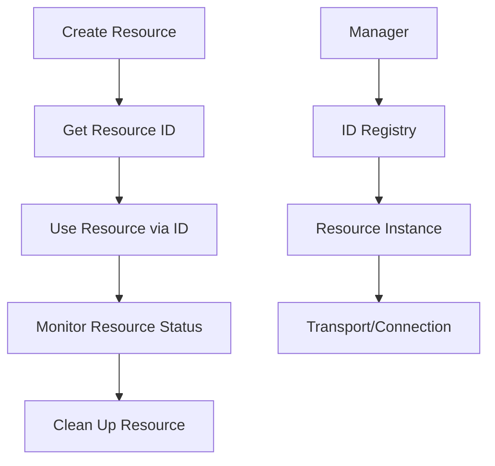

# Architecture

Understand the internal structure and design principles of the Flutter MCP plugin.

## Overview

Flutter MCP uses a **singleton pattern** with a **manager-based architecture**. All functionality is accessed through the `FlutterMCP.instance` singleton, which provides access to specialized managers for different aspects of the MCP protocol.

## Core Architecture

### Singleton Instance

```dart
// All MCP functionality is accessed through the singleton
FlutterMCP.instance
```

The singleton pattern ensures:
- Single point of initialization
- Consistent state management
- Resource sharing across the application
- Proper cleanup on shutdown

### Manager-Based Architecture

Flutter MCP organizes functionality into specialized managers:

```dart
FlutterMCP.instance
  ├── clientManager     // MCP client connections
  ├── serverManager     // MCP server processes
  ├── llmManager        // LLM integrations
  ├── backgroundService // Background tasks
  ├── scheduler         // Job scheduling
  └── pluginRegistry    // Plugin management
```

## Core Components

### 1. Client Manager (MCPClientManager)

Manages MCP client connections with ID-based resource tracking.

```dart
class MCPClientManager {
  // Store clients by ID
  final Map<String, ClientInfo> _clients = {};
  
  // Create a new client and return its ID
  Future<String> createClient(MCPClientConfig config) async {
    final clientId = _generateClientId();
    final client = await _createMCPClient(config);
    _clients[clientId] = ClientInfo(
      id: clientId,
      client: client,
      config: config,
    );
    return clientId;
  }
  
  // Connect a client by ID
  Future<void> connectClient(String clientId) async {
    final info = _clients[clientId];
    await info?.client.connect();
  }
  
  // Call tools on a client
  Future<dynamic> callTool(String clientId, String tool, Map<String, dynamic> args) async {
    final info = _clients[clientId];
    return await info?.client.callTool(tool, args);
  }
  
  // Get client information
  ClientInfo? getClientInfo(String clientId) => _clients[clientId];
  
  // Monitor all clients
  Stream<List<ClientInfo>> get clientStream => _clientStreamController.stream;
}
```

### 2. Server Manager (MCPServerManager)

Manages MCP server processes and their lifecycle.

```dart
class MCPServerManager {
  // Store servers by ID
  final Map<String, ServerInfo> _servers = {};
  
  // Add server configuration
  Future<String> addServer(MCPServerConfig config) async {
    final serverId = _generateServerId();
    _servers[serverId] = ServerInfo(
      id: serverId,
      config: config,
      status: ServerStatus.stopped,
    );
    return serverId;
  }
  
  // Start a server process
  Future<void> startServer(String serverId) async {
    final info = _servers[serverId];
    if (info != null) {
      final server = await _createServer(info.config);
      await server.start();
      info.server = server;
      info.status = ServerStatus.running;
    }
  }
  
  // Monitor server status
  Stream<List<ServerInfo>> get serverStream => _serverStreamController.stream;
}
```

### 3. LLM Manager (MCPLlmManager)

Manages language model integrations and queries.

```dart
class MCPLlmManager {
  // Store LLMs by ID
  final Map<String, LlmInfo> _llms = {};
  
  // Add LLM configuration
  Future<String> addLLM(LLMConfig config) async {
    final llmId = config.id ?? _generateLlmId();
    final llm = await _createLLM(config);
    _llms[llmId] = LlmInfo(
      id: llmId,
      mcpLlm: llm,
      config: config,
    );
    return llmId;
  }
  
  // Execute LLM query
  Future<LLMResponse> query({
    required String llmId,
    required String prompt,
    QueryOptions? options,
  }) async {
    final info = _llms[llmId];
    return await info?.mcpLlm.query(prompt, options);
  }
}
```

### 4. Platform Services

Handles platform-specific features like background execution, notifications, and system tray.

```dart
class PlatformServices {
  // Background service management
  BackgroundService? _backgroundService;
  
  // Notification management
  NotificationManager? _notificationManager;
  
  // System tray management (desktop)
  TrayManager? _trayManager;
  
  Future<void> initialize(MCPConfig config) async {
    if (config.useBackgroundService) {
      _backgroundService = BackgroundService.create();
      await _backgroundService!.initialize(config.background);
    }
    
    if (config.useNotification) {
      _notificationManager = NotificationManager.create();
      await _notificationManager!.initialize(config.notification);
    }
    
    if (config.useTray && _isDesktopPlatform()) {
      _trayManager = TrayManager.create();
      await _trayManager!.initialize(config.tray);
    }
  }
}
```

## Resource Management

### ID-Based Resource Tracking

All resources (clients, servers, LLMs) are managed through string IDs:

```dart
// Create resources and get IDs
final clientId = await FlutterMCP.instance.createClient(...);
final serverId = await FlutterMCP.instance.serverManager.addServer(...);
final llmId = await FlutterMCP.instance.llmManager.addLLM(...);

// Use IDs to interact with resources
await FlutterMCP.instance.connectClient(clientId);
await FlutterMCP.instance.serverManager.startServer(serverId);
await FlutterMCP.instance.llmManager.query(llmId: llmId, ...);

// Clean up using IDs
await FlutterMCP.instance.clientManager.closeClient(clientId);
await FlutterMCP.instance.serverManager.stopServer(serverId);
```

### Resource Lifecycle



## Initialization Flow

```dart
// 1. Initialize the singleton
await FlutterMCP.instance.init(MCPConfig(...));

// 2. Managers are automatically initialized
// - ClientManager ready
// - ServerManager ready
// - LlmManager ready
// - PlatformServices configured

// 3. Create and use resources
final clientId = await FlutterMCP.instance.createClient(...);
await FlutterMCP.instance.connectClient(clientId);
```

## Error Handling Architecture

### Enhanced Error Handler

```dart
class EnhancedErrorHandler {
  // Global error handling
  static Future<T> handleError<T>(Future<T> Function() operation) async {
    try {
      return await operation();
    } on MCPConnectionException {
      // Handle connection errors
      rethrow;
    } on MCPException {
      // Handle MCP protocol errors
      rethrow;
    } catch (e) {
      // Log unexpected errors
      _logger.error('Unexpected error: $e');
      rethrow;
    }
  }
}
```

### Circuit Breaker Pattern

```dart
class CircuitBreaker {
  int _failureCount = 0;
  bool _isOpen = false;
  
  Future<T> execute<T>(Future<T> Function() operation) async {
    if (_isOpen) {
      throw CircuitBreakerOpenException();
    }
    
    try {
      final result = await operation();
      _reset();
      return result;
    } catch (e) {
      _recordFailure();
      rethrow;
    }
  }
}
```

## Performance Features

### 1. Object Pooling

```dart
final ObjectPool<Stopwatch> _stopwatchPool = ObjectPool<Stopwatch>(
  factory: () => Stopwatch(),
  reset: (sw) => sw.reset(),
);
```

### 2. Semantic Caching

```dart
final Map<String, SemanticCache> _llmResponseCaches = {};

// Cache LLM responses with semantic similarity
final cache = SemanticCache(
  maxEntries: 1000,
  similarityThreshold: 0.85,
);
```

### 3. Memory Management

```dart
class MemoryManager {
  static void monitorMemory() {
    if (_isHighMemoryUsage()) {
      _triggerCleanup();
    }
  }
}
```

## Plugin System

### Enhanced Plugin Registry

```dart
class EnhancedPluginRegistry {
  final Map<String, MCPPlugin> _plugins = {};
  
  Future<void> registerPlugin(MCPPlugin plugin) async {
    await plugin.initialize();
    _plugins[plugin.id] = plugin;
  }
  
  T? getPlugin<T extends MCPPlugin>(String id) {
    return _plugins[id] as T?;
  }
}
```

### Plugin Types

- **MCPToolPlugin** - Provides tools to MCP servers
- **MCPResourcePlugin** - Manages resources
- **MCPBackgroundPlugin** - Background task execution
- **MCPNotificationPlugin** - Custom notifications
- **MCPPromptPlugin** - Prompt templates

## Security Architecture

### Security Audit Manager

```dart
class SecurityAuditManager {
  void logSecurityEvent(SecurityAuditEvent event) {
    _auditLog.add(event);
    if (event.severity == SecuritySeverity.critical) {
      _notifySecurityTeam(event);
    }
  }
}
```

### Encryption Manager

```dart
class EncryptionManager {
  Future<String> encrypt(String data) async {
    return await _performEncryption(data, _currentKey);
  }
  
  Future<String> decrypt(String encrypted) async {
    return await _performDecryption(encrypted, _currentKey);
  }
}
```

## Event System

### Event-Driven Communication

```dart
class EventSystem {
  final _eventBus = StreamController<MCPEvent>.broadcast();
  
  void emit(MCPEvent event) {
    _eventBus.add(event);
  }
  
  Stream<T> on<T extends MCPEvent>() {
    return _eventBus.stream.whereType<T>();
  }
}
```

## Best Practices

### 1. Always Initialize First

```dart
// ✅ Good
await FlutterMCP.instance.init(config);
final clientId = await FlutterMCP.instance.createClient(...);

// ❌ Bad - will throw "not initialized" error
final clientId = await FlutterMCP.instance.createClient(...);
```

### 2. Use ID-Based Management

```dart
// ✅ Good - store and use IDs
final clientId = await FlutterMCP.instance.createClient(...);
await FlutterMCP.instance.connectClient(clientId);

// ❌ Bad - trying to access client directly
final client = await FlutterMCP.instance.createClient(...);
await client.connect(); // This pattern doesn't exist
```

### 3. Clean Up Resources

```dart
// ✅ Good - proper cleanup
@override
void dispose() {
  if (_clientId != null) {
    FlutterMCP.instance.clientManager.closeClient(_clientId!);
  }
  super.dispose();
}
```

## Next Steps

- [Plugin Development](../plugins/development.md) - Create custom plugins
- [Performance Tuning](../advanced/performance-tuning.md) - Optimize performance
- [Security Guide](../advanced/security.md) - Security best practices