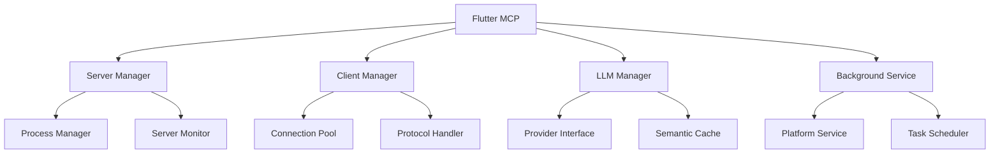

# Architecture

Understand the internal structure and design principles of the Flutter MCP plugin.

## Overview

Flutter MCP is a plugin that integrates the Model Context Protocol into Flutter applications. It adopts a modular architecture to enhance extensibility and maintainability.

## Core Components

### 1. Server Manager
Manages the lifecycle of MCP servers.

```dart
class ServerManager {
  // Server process management
  Map<String, ServerInfo> _servers;
  
  // Server start, stop, restart
  Future<void> startServer(String serverId);
  Future<void> stopServer(String serverId);
  
  // Server status monitoring
  Stream<List<ServerInfo>> get serverStream;
}
```

### 2. Client Manager
Handles creation and management of MCP clients.

```dart
class ClientManager {
  // Client pool management
  Map<String, ClientInfo> _clients;
  
  // Client creation and connection
  Future<MCPClient> createClient(ClientConfig config);
  
  // Client status monitoring
  Stream<List<ClientInfo>> get clientStream;
}
```

### 3. LLM Manager
Manages language model integration.

```dart
class LLMManager {
  // LLM provider management
  Map<String, LLMProvider> _providers;
  
  // Query execution
  Future<LLMResponse> query(String llmId, String prompt);
  
  // Caching and optimization
  SemanticCache _cache;
}
```

### 4. Background Service
Handles platform-specific background tasks.

```dart
abstract class BackgroundService {
  // Platform-specific implementation
  factory BackgroundService.create() {
    if (Platform.isAndroid) return AndroidBackground();
    if (Platform.isIOS) return IOSBackground();
    // ...
  }
  
  // Task registration and execution
  Future<void> registerTask(String taskId, TaskHandler handler);
}
```

## Architecture Diagram



## Design Patterns

### 1. Dependency Injection
```dart
class DependencyInjection {
  static final _container = <Type, dynamic>{};
  
  static void register<T>(T instance) {
    _container[T] = instance;
  }
  
  static T get<T>() {
    return _container[T] as T;
  }
}
```

### 2. Event-Based Architecture
```dart
class EventBus {
  final _streamController = StreamController<Event>.broadcast();
  
  void emit(Event event) {
    _streamController.add(event);
  }
  
  Stream<T> on<T extends Event>() {
    return _streamController.stream.whereType<T>();
  }
}
```

### 3. Plugin System
```dart
abstract class MCPPlugin {
  String get id;
  String get version;
  
  Future<void> initialize();
  Future<void> dispose();
}
```

## Data Flow

1. **Command Execution Flow**
   ```
   User -> Flutter MCP -> Client Manager -> MCP Client -> Server
   ```

2. **Response Processing Flow**
   ```
   Server -> MCP Client -> Client Manager -> Flutter MCP -> User
   ```

3. **Background Task Flow**
   ```
   Scheduler -> Background Service -> Task Handler -> Flutter MCP
   ```

## Error Handling

### Circuit Breaker
```dart
class CircuitBreaker {
  int _failureCount = 0;
  bool _isOpen = false;
  
  Future<T> execute<T>(Future<T> Function() operation) async {
    if (_isOpen) {
      throw CircuitBreakerOpenException();
    }
    
    try {
      final result = await operation();
      _reset();
      return result;
    } catch (e) {
      _recordFailure();
      rethrow;
    }
  }
}
```

### Error Recovery
```dart
class ErrorRecovery {
  static Future<T> withRetry<T>(
    Future<T> Function() operation,
    {int maxRetries = 3}
  ) async {
    for (int i = 0; i <= maxRetries; i++) {
      try {
        return await operation();
      } catch (e) {
        if (i == maxRetries) rethrow;
        await Future.delayed(Duration(seconds: i + 1));
      }
    }
    throw Exception('Max retries exceeded');
  }
}
```

## Performance Optimization

### 1. Object Pooling
```dart
class ObjectPool<T> {
  final Queue<T> _pool = Queue();
  final T Function() _factory;
  
  T acquire() {
    return _pool.isNotEmpty ? _pool.removeFirst() : _factory();
  }
  
  void release(T object) {
    _pool.add(object);
  }
}
```

### 2. Memory Management
```dart
class MemoryManager {
  static int get currentMemoryUsage {
    return ProcessInfo.currentRss;
  }
  
  static Future<void> optimizeMemory() async {
    // Clear unused caches
    await _clearUnusedCaches();
    // Garbage collection hint
    System.gc();
  }
}
```

### 3. Isolated Execution
```dart
class IsolatePool {
  final List<Isolate> _isolates = [];
  
  Future<R> run<T, R>(ComputeCallback<T, R> callback, T input) async {
    final isolate = await _getAvailableIsolate();
    return compute(callback, input);
  }
}
```

## Security

### 1. Credential Management
```dart
class CredentialManager {
  final SecureStorage _storage;
  
  Future<void> storeCredential(String key, String value) async {
    final encrypted = await _encrypt(value);
    await _storage.write(key, encrypted);
  }
}
```

### 2. Communication Security
- TLS 1.3 support
- Certificate pinning
- API key encryption

## Extensibility

### Custom Providers
```dart
abstract class CustomProvider {
  Future<Response> execute(Request request);
}

class MyCustomProvider extends CustomProvider {
  @override
  Future<Response> execute(Request request) async {
    // Custom logic
  }
}
```

### Plugin Hooks
```dart
class PluginHooks {
  static final beforeExecute = <Function>[];
  static final afterExecute = <Function>[];
  
  static void register(HookType type, Function hook) {
    switch (type) {
      case HookType.beforeExecute:
        beforeExecute.add(hook);
        break;
      case HookType.afterExecute:
        afterExecute.add(hook);
        break;
    }
  }
}
```

## Next Steps

- [Plugin Development](../plugins/development.md) - Create custom plugins
- [Performance Optimization](../advanced/performance.md) - Performance tuning guide
- [Security Guide](../advanced/security.md) - Security best practices