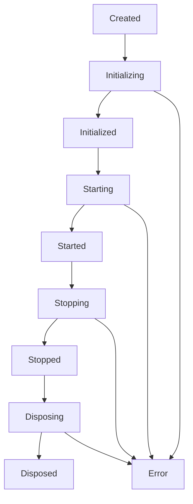

# Plugin Lifecycle

Understanding the lifecycle of Flutter MCP plugins is crucial for proper resource management and behavior.

## Lifecycle States

Plugins go through several lifecycle states:

```dart
enum PluginLifecycleState {
  created,       // Plugin instance created
  initializing,  // Initialize() in progress
  initialized,   // Initialize() completed
  starting,      // onStart() in progress
  started,       // onStart() completed, plugin active
  stopping,      // onStop() in progress
  stopped,       // onStop() completed
  disposing,     // dispose() in progress
  disposed,      // dispose() completed, plugin terminated
  error,         // Plugin encountered an error
}
```

## Lifecycle Flow



## Lifecycle Methods

### Constructor

The plugin constructor should only set up basic properties, not perform initialization.

```dart
class MyPlugin extends MCPPlugin {
  // ✅ Good: Only set properties
  MyPlugin() {
    _logger = Logger('MyPlugin');
  }
  
  // ❌ Bad: Don't initialize resources in constructor
  MyPlugin() {
    _database = openDatabase(); // Wrong!
  }
}
```

### initialize()

Called once when the plugin is registered.

```dart
@override
Future<void> initialize(PluginContext context) async {
  // Store context for later use
  _context = context;
  
  // Validate configuration
  _validateConfig(context.config);
  
  // Initialize resources
  await _initializeResources();
  
  // Set up event listeners
  _setupEventListeners();
  
  // Register with other services
  await _registerServices();
  
  context.logger.info('Plugin initialized');
}
```

### onStart()

Called when the plugin should start active operation.

```dart
@override
void onStart() {
  _context.logger.info('Plugin starting');
  
  // Start background tasks
  _startBackgroundTasks();
  
  // Begin monitoring
  _startMonitoring();
  
  // Enable features
  _enableFeatures();
  
  _isActive = true;
}
```

### onStop()

Called when the plugin should stop active operation.

```dart
@override
void onStop() {
  _context.logger.info('Plugin stopping');
  
  _isActive = false;
  
  // Stop background tasks
  _stopBackgroundTasks();
  
  // Stop monitoring
  _stopMonitoring();
  
  // Disable features
  _disableFeatures();
}
```

### onPause()

Called when the plugin should pause operations (mobile platforms).

```dart
@override
void onPause() {
  _context.logger.info('Plugin pausing');
  
  // Pause non-critical operations
  _pauseOperations();
  
  // Save state
  _saveState();
  
  // Reduce resource usage
  _reduceResourceUsage();
}
```

### onResume()

Called when the plugin should resume from pause.

```dart
@override
void onResume() {
  _context.logger.info('Plugin resuming');
  
  // Restore state
  _restoreState();
  
  // Resume operations
  _resumeOperations();
  
  // Restore resource usage
  _restoreResourceUsage();
}
```

### dispose()

Called when the plugin is being removed.

```dart
@override
Future<void> dispose() async {
  _context.logger.info('Plugin disposing');
  
  // Cancel subscriptions
  await _cancelSubscriptions();
  
  // Close connections
  await _closeConnections();
  
  // Release resources
  await _releaseResources();
  
  // Clear caches
  _clearCaches();
  
  _context.logger.info('Plugin disposed');
}
```

## State Transitions

### Plugin Registration

```dart
// When a plugin is registered
final plugin = MyPlugin();
final registry = mcp.pluginRegistry;

// State: created
await registry.register(plugin);
// State: created -> initializing -> initialized

// Plugin is now ready to be started
```

### Plugin Activation

```dart
// Start the plugin
await plugin.start();
// State: initialized -> starting -> started

// Plugin is now active and processing
```

### Plugin Deactivation

```dart
// Stop the plugin
await plugin.stop();
// State: started -> stopping -> stopped

// Plugin is inactive but still registered
```

### Plugin Removal

```dart
// Unregister the plugin
await registry.unregister(plugin.id);
// State: stopped -> disposing -> disposed

// Plugin is completely removed
```

## Lifecycle Management

### PluginLifecycleManager

```dart
class PluginLifecycleManager {
  PluginLifecycleState _state = PluginLifecycleState.created;
  final _stateController = StreamController<PluginLifecycleState>.broadcast();
  
  PluginLifecycleState get state => _state;
  Stream<PluginLifecycleState> get stateStream => _stateController.stream;
  
  void _setState(PluginLifecycleState newState) {
    final oldState = _state;
    _state = newState;
    _stateController.add(newState);
    
    _context.logger.debug('State transition: $oldState -> $newState');
  }
  
  Future<void> initialize(PluginContext context) async {
    _setState(PluginLifecycleState.initializing);
    
    try {
      await _performInitialization(context);
      _setState(PluginLifecycleState.initialized);
    } catch (e) {
      _setState(PluginLifecycleState.error);
      throw PluginInitializationException(
        'Failed to initialize plugin: $e',
      );
    }
  }
}
```

### Lifecycle Events

```dart
// Listen to lifecycle state changes
plugin.lifecycleManager.stateStream.listen((state) {
  switch (state) {
    case PluginLifecycleState.started:
      print('Plugin is now active');
      break;
    case PluginLifecycleState.error:
      print('Plugin encountered an error');
      break;
    case PluginLifecycleState.disposed:
      print('Plugin has been removed');
      break;
  }
});
```

## Error Handling

### Handling Lifecycle Errors

```dart
class MyPlugin extends MCPPlugin {
  @override
  Future<void> initialize(PluginContext context) async {
    try {
      await super.initialize(context);
      
      // Initialization logic
      await _connectToService();
      
    } catch (e, stackTrace) {
      context.logger.error('Initialization failed', e, stackTrace);
      
      // Clean up partially initialized resources
      await _cleanupPartialInit();
      
      // Re-throw as plugin exception
      throw PluginInitializationException(
        'Failed to initialize ${this.name}: $e',
        cause: e,
        stackTrace: stackTrace,
      );
    }
  }
  
  Future<void> _cleanupPartialInit() async {
    // Clean up any resources that were partially initialized
    try {
      await _service?.disconnect();
    } catch (e) {
      // Ignore cleanup errors
    }
  }
}
```

### Recovery Strategies

```dart
class ResilientPlugin extends MCPPlugin {
  int _retryCount = 0;
  static const _maxRetries = 3;
  
  @override
  Future<void> initialize(PluginContext context) async {
    try {
      await _attemptInitialization(context);
    } catch (e) {
      if (_retryCount < _maxRetries) {
        _retryCount++;
        context.logger.warning(
          'Initialization failed, retrying (${_retryCount}/${_maxRetries})',
        );
        
        // Wait before retry
        await Future.delayed(Duration(seconds: _retryCount * 2));
        
        // Retry initialization
        await initialize(context);
      } else {
        // Give up after max retries
        throw e;
      }
    }
  }
}
```

## Best Practices

### 1. Proper Resource Management

```dart
class ResourceAwarePlugin extends MCPPlugin {
  Timer? _timer;
  StreamSubscription? _subscription;
  Database? _database;
  
  @override
  Future<void> initialize(PluginContext context) async {
    await super.initialize(context);
    
    // Track resources for cleanup
    _database = await openDatabase();
    _timer = Timer.periodic(Duration(seconds: 30), _performTask);
    _subscription = someStream.listen(_handleEvent);
  }
  
  @override
  Future<void> dispose() async {
    // Clean up in reverse order of initialization
    await _subscription?.cancel();
    _timer?.cancel();
    await _database?.close();
    
    await super.dispose();
  }
}
```

### 2. State Validation

```dart
class StateAwarePlugin extends MCPPlugin {
  bool _isInitialized = false;
  bool _isActive = false;
  
  void performOperation() {
    // Validate state before operations
    if (!_isInitialized) {
      throw StateError('Plugin not initialized');
    }
    
    if (!_isActive) {
      throw StateError('Plugin not active');
    }
    
    // Perform operation
    _doWork();
  }
  
  @override
  Future<void> initialize(PluginContext context) async {
    await super.initialize(context);
    _isInitialized = true;
  }
  
  @override
  void onStart() {
    super.onStart();
    _isActive = true;
  }
  
  @override
  void onStop() {
    _isActive = false;
    super.onStop();
  }
}
```

### 3. Graceful Shutdown

```dart
class GracefulPlugin extends MCPPlugin {
  final List<Future<void>> _pendingOperations = [];
  
  Future<void> performAsyncOperation() async {
    final operation = _doAsyncWork();
    _pendingOperations.add(operation);
    
    try {
      await operation;
    } finally {
      _pendingOperations.remove(operation);
    }
  }
  
  @override
  Future<void> dispose() async {
    // Wait for pending operations
    if (_pendingOperations.isNotEmpty) {
      _context.logger.info(
        'Waiting for ${_pendingOperations.length} operations to complete',
      );
      
      await Future.wait(
        _pendingOperations,
        eagerError: false,
      ).timeout(
        Duration(seconds: 30),
        onTimeout: () {
          _context.logger.warning('Timeout waiting for operations');
        },
      );
    }
    
    await super.dispose();
  }
}
```

### 4. Lifecycle Hooks

```dart
class HookedPlugin extends MCPPlugin {
  final List<VoidCallback> _onStartCallbacks = [];
  final List<VoidCallback> _onStopCallbacks = [];
  
  void addOnStartCallback(VoidCallback callback) {
    _onStartCallbacks.add(callback);
  }
  
  void addOnStopCallback(VoidCallback callback) {
    _onStopCallbacks.add(callback);
  }
  
  @override
  void onStart() {
    super.onStart();
    
    for (final callback in _onStartCallbacks) {
      try {
        callback();
      } catch (e) {
        _context.logger.error('Start callback failed', e);
      }
    }
  }
  
  @override
  void onStop() {
    for (final callback in _onStopCallbacks) {
      try {
        callback();
      } catch (e) {
        _context.logger.error('Stop callback failed', e);
      }
    }
    
    super.onStop();
  }
}
```

## Testing Lifecycle

### Unit Testing

```dart
test('plugin lifecycle', () async {
  final plugin = MyPlugin();
  final context = MockPluginContext();
  
  // Test initialization
  expect(plugin.state, equals(PluginLifecycleState.created));
  
  await plugin.initialize(context);
  expect(plugin.state, equals(PluginLifecycleState.initialized));
  
  // Test start
  plugin.onStart();
  expect(plugin.state, equals(PluginLifecycleState.started));
  
  // Test stop
  plugin.onStop();
  expect(plugin.state, equals(PluginLifecycleState.stopped));
  
  // Test disposal
  await plugin.dispose();
  expect(plugin.state, equals(PluginLifecycleState.disposed));
});
```

### Integration Testing

```dart
test('plugin integration lifecycle', () async {
  final mcp = FlutterMCP();
  await mcp.initialize();
  
  final plugin = MyPlugin();
  final registry = mcp.pluginRegistry;
  
  // Monitor lifecycle events
  final states = <PluginLifecycleState>[];
  plugin.lifecycleManager.stateStream.listen(states.add);
  
  // Register plugin
  await registry.register(plugin);
  await plugin.start();
  
  // Use plugin
  await plugin.performOperation();
  
  // Cleanup
  await plugin.stop();
  await registry.unregister(plugin.id);
  
  // Verify lifecycle progression
  expect(states, contains(PluginLifecycleState.initialized));
  expect(states, contains(PluginLifecycleState.started));
  expect(states, contains(PluginLifecycleState.stopped));
  expect(states, contains(PluginLifecycleState.disposed));
});
```

## Common Patterns

### Lazy Initialization

```dart
class LazyPlugin extends MCPPlugin {
  MyService? _service;
  
  MyService get service {
    if (_service == null) {
      throw StateError('Plugin not initialized');
    }
    return _service!;
  }
  
  @override
  Future<void> initialize(PluginContext context) async {
    await super.initialize(context);
    
    // Lazy initialization of expensive resources
    _context.eventBus.once<ServiceNeededEvent>().then((_) async {
      _service ??= await MyService.create();
    });
  }
}
```

### Hot Reload Support

```dart
class HotReloadablePlugin extends MCPPlugin {
  @override
  Future<void> initialize(PluginContext context) async {
    await super.initialize(context);
    
    if (kDebugMode) {
      // Support hot reload in development
      _setupHotReload();
    }
  }
  
  void _setupHotReload() {
    // Re-register event listeners on hot reload
    _context.eventBus.on<HotReloadEvent>().listen((_) {
      _clearEventListeners();
      _setupEventListeners();
      _context.logger.debug('Plugin reloaded');
    });
  }
}
```

### Dependency Management

```dart
class DependentPlugin extends MCPPlugin {
  @override
  List<String> get dependencies => ['database_plugin', 'auth_plugin'];
  
  @override
  Future<void> initialize(PluginContext context) async {
    await super.initialize(context);
    
    // Check dependencies
    for (final dep in dependencies) {
      final plugin = context.registry.getPlugin(dep);
      if (plugin == null) {
        throw PluginDependencyException(
          'Required plugin not found: $dep',
        );
      }
      
      // Wait for dependency to be ready
      if (plugin.state != PluginLifecycleState.started) {
        await plugin.lifecycleManager.stateStream
            .firstWhere((state) => state == PluginLifecycleState.started)
            .timeout(Duration(seconds: 30));
      }
    }
    
    // Dependencies are ready, proceed with initialization
    await _initializeWithDependencies();
  }
}
```

## Monitoring

### Lifecycle Metrics

```dart
class MonitoredPlugin extends MCPPlugin {
  final _metrics = PluginMetrics();
  
  @override
  Future<void> initialize(PluginContext context) async {
    final stopwatch = Stopwatch()..start();
    
    try {
      await super.initialize(context);
      _metrics.initializationTime = stopwatch.elapsed;
      _metrics.initializationSuccess = true;
    } catch (e) {
      _metrics.initializationSuccess = false;
      _metrics.lastError = e.toString();
      rethrow;
    }
  }
  
  @override
  void onStart() {
    _metrics.startCount++;
    _metrics.lastStartTime = DateTime.now();
    super.onStart();
  }
  
  PluginMetrics get metrics => _metrics;
}

class PluginMetrics {
  Duration? initializationTime;
  bool initializationSuccess = false;
  int startCount = 0;
  DateTime? lastStartTime;
  String? lastError;
  
  Map<String, dynamic> toJson() => {
    'initializationTime': initializationTime?.inMilliseconds,
    'initializationSuccess': initializationSuccess,
    'startCount': startCount,
    'lastStartTime': lastStartTime?.toIso8601String(),
    'lastError': lastError,
  };
}
```

## Next Steps

- [Plugin Communication](communication.md) - Inter-plugin communication
- [Plugin Examples](examples.md) - Example implementations
- [Development Guide](development.md) - Creating plugins
- [API Reference](../api/plugin-system.md) - Plugin API